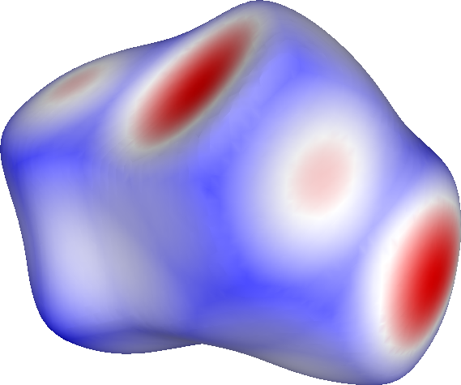

# chmpy


A library for computational chemistry in python. Featuring support for
molecules, crystals, Hirshfeld & promolecule density isosurfaces,
spherical harmonic shape descriptors and much more...

## Installation

Basic installation can be done through the python package manager `pip`:

```bash
pip install chmpy
# or to install directly from GitHub:
pip install git+https://github.com/peterspackman/chmpy.git
```

For development or modifications, install locally using pip:

```bash
pip install -e .
```

## Features
While the library is intended to be flexible and make it easy to build
complex pipelines or properties, the following is a brief summary of
intended features:

- Load crystal structures from `.cif`, `.res`, `POSCAR` files.
- Evaluate promolecule and procrystal electron densities.
- Easily generate Hirshfeld or promolecule isosurfaces and associated properties.
- Easily generate spherical harmonic shape descriptors for atoms, molecules, or molecular fragments.
- Efficiently calculate crystal slabs, periodic connectivity and more...
- Automatic parallelization of some calculations using OpenMP (set the `OMP_NUM_THREADS` environment variable)

It should also serve as a simple, easy to read library for learning
how to represent crystal structures, molecules etc. and evaluate
scientifically relevant information quickly and efficiently using
python.

## Examples

### Crystal structures and molecules

Loading a crystal structure from a CIF (`.cif`) or SHELX (`.res`)
file, or a molecule from an XMOL (`.xyz`) file is straightforward:

```python
from chmpy import Crystal, Molecule
c = Crystal.load("tests/acetic_acid.cif")
print(c)
# <Crystal C2H4O2 Pna2_1>
# Calculate the unique molecules in this crystal
c.symmetry_unique_molecules()
# [<Molecule: C2H4O2(2.12,1.15,0.97)>]
m = Molecule.load("tests/water.xyz")
print(m)
# <Molecule: H2O(-0.67,-0.00,0.01)>
```

### Hirshfeld and promolecule density isosurfaces

Hirshfeld and promolecule density isosurfaces

Generation of surfaces with the default settings can be done with
minimal hassle, simply by using the corresponding members of the Crystal
class:

```python
c = Crystal.load("tests/test_files/acetic_acid.cif")
# This will generate a high resolution surface
# for each symmetry unique molecule in the crystal
surfaces = c.hirshfeld_surfaces()
print(surfaces)
# [<trimesh.Trimesh(vertices.shape=(3598, 3), faces.shape=(7192, 3))>]
# We can generate lower resolution surfaces with the separation parameter
surfaces = c.hirshfeld_surfaces(separation=0.5)
print(surfaces)
# [<trimesh.Trimesh(vertices.shape=(584, 3), faces.shape=(1164, 3))>]
# Surfaces can be saved via trimesh, or a utility function provided in chmpy
from chmpy.util.mesh import save_mesh
save_mesh(surfaces[0], "acetic_acid.ply")
```
    
The resulting surface should look something like this when visualized:




